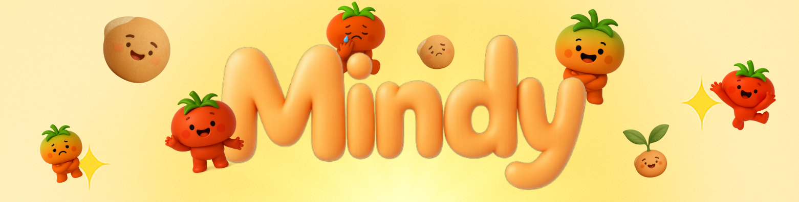

<div align="center">
  
</div>

## 📱 Project Overview

**Mindy** is a mobile application designed for children to interact with a tomato character through voice. The AI analyzes these conversations to generate emotional reports for parents, helping them better understand their child's emotional state.

## 🌟 Key Features

### 🍅 Talk with Tomato
- **Voice Recognition**: Children talk to the tomato character using voice
- **TTS Responses**: The tomato responds via text-to-speech
- **Emotion Analysis**: AI analyzes conversation to detect emotional state
- **Tomato Growth**: The tomato evolves with each interaction (Seed → Sprout → Young Tomato → Grown Tomato)

### 📊 Parent Mode
- **Emotion Reports**: Daily emotional insights based on interactions
- **Keyword Extraction**: Automatically identifies key terms from conversations
- **Alerts**: Notifies parents of significant emotional indicators
- **Growth Guide**: Parenting tips based on tomato growth stages

### ⚙️ Settings
- **Password Management**: Set or change the access code for Parent Mode
- **Notification Settings**: Customize alerts and sound preferences
- **Terms of Use**: View and agree to app terms

## 📁 Project Structure


```
lib/
├── config/
│ └── api_config.dart                  # API configuration
├── models/
│ └── app_state.dart                   # App state model
├── screens/
│ ├── mode_selection_screen.dart       # Mode selection screen
│ ├── child_home_screen.dart           # Child mode home
│ ├── parent_home_screen.dart          # Parent mode home
│ ├── emotion_report_screen.dart       # Emotion report view
│ ├── settings_screen.dart             # Settings screen
│ ├── terms_screen.dart                # Terms and conditions
│ └── ...
├── services/
│ ├── toma_chat_service.dart           # Tomato chat service
│ ├── tts_service.dart                 # TTS (Text-to-Speech) service
│ └── app_state.dart                   # App state management
└── widgets/                           # Reusable UI components
```


## 🚀 Installation & Running

### Prerequisites
- Flutter SDK (version 3.8.1 or higher)
- Dart SDK
- Android Studio or VS Code
- OpenAI API Key

## 🔧 Environment Configuration

### Setting Up OpenAI API Key

#### Option 1: Via Command Line
```bash
flutter run --dart-define=OPENAI_API_KEY=sk-your-actual-api-key-here
```

#### Option 2: As Environment Variable
**Windows:**
```cmd
set OPENAI_API_KEY=sk-your-actual-api-key-here
flutter run
```

**macOS/Linux:**
```bash
export OPENAI_API_KEY=sk-your-actual-api-key-here
flutter run
```

#### Option 3: Through IDE Configuration
Add the following to your launch configuration in Android Studio or VS Code:
```json
{
  "args": [
    "--dart-define=OPENAI_API_KEY=sk-your-actual-api-key-here"
  ]
}
```

### Getting an API Key
1. Visit  [OpenAI Platform](https://platform.openai.com/)
2. Go to the API Keys section and generate a new key
3. Copy and apply the key using one of the above methods

### Required Permissions
The app requires the following permissions:
- Speech recognition
- Internet access
- Storage access

## 📱 How to Use

### Child Mode
1. Launch the app and select "Child Mode"
2. Talk with the tomato character using voice
3. Watch the tomato grow with each conversation
4. The tomato's expression changes based on emotion

### Parent Mode
1. Enter the password to access "Parent Mode"
2. Review the daily emotion reports
3. Check extracted keywords and alerts
4. Get parenting advice based on the tomato's growth stage

---

**Mindy** - Your child’s emotional companion, the Tomato 🍅